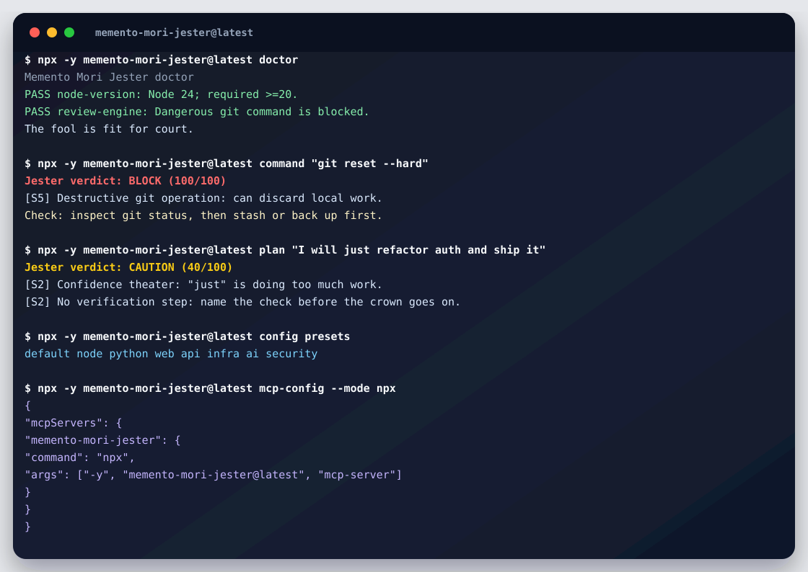

# Memento Mori Jester

[](https://github.com/Martin123132/Memento-Mori/actions/workflows/ci.yml)
[](https://www.npmjs.com/package/memento-mori-jester)
[](LICENSE)

A local court-jester sidecar for AI coding agents. It reviews plans, shell commands, diffs, and final answers before they get too pleased with themselves.

It roasts the reasoning, not the human.

## Demo

[](docs/DEMO.md)

See the full [demo transcript](docs/DEMO.md).

## Start Here

No install needed:

```powershell
npx -y memento-mori-jester@latest start
npx -y memento-mori-jester@latest doctor
npx -y memento-mori-jester@latest command "git reset --hard"
npx -y memento-mori-jester@latest playground
```

Add it to a project:

```powershell
npx -y memento-mori-jester@latest bootstrap --preset node
```

That writes:

- `jester.config.json`
- `memento-mori.mcp.json`
- `MEMENTO_MORI.md`

Add it to GitHub code scanning:

```powershell
npx -y memento-mori-jester@latest github-action --write
```

Expected vibe:

```text
Jester verdict: BLOCK (100/100)
A dazzling command, if the desired outcome is court-sponsored regret.
```

## What It Does

| Surface | Example | What it catches |
| --- | --- | --- |
| Plans | `jester plan "I will just refactor auth and ship it"` | overconfidence, missing verification, risky domains |
| Commands | `jester command "git reset --hard"` | destructive shell commands and broad file operations |
| Diffs | `git diff \| jester diff --fail-on block` | removed tests, install scripts, env/config risks |
| Final answers | `jester final --file final.txt` | done/fixed claims without evidence |
| Explanations | `jester explain command "git reset --hard"` | plain-language teaching notes for verdicts |
| Start | `jester start` | guided first-run checklist for setup, bootstrap, validation, and smoke checks |
| Playground | `jester playground` | local paste-in checks for commands, plans, diffs, and final answers |
| Examples | `jester examples` | copy-paste commands and links for new users |
| Rules | `jester rules --kind diff` | visible rule catalog for built-in and project checks |
| GitHub Actions | `jester github-action --write` | SARIF workflow for code scanning |
| Agents | `jester setup --agent codex` | exact MCP snippets and agent instructions for Codex, Claude Code, and generic clients |

## Try It Locally

Installed globally:

```powershell
npm install -g memento-mori-jester
jester command "Remove-Item .\dist -Recurse -Force"
```

From a local checkout:

```powershell
git clone https://github.com/Martin123132/Memento-Mori.git
cd Memento-Mori
npm.cmd install
npm.cmd run build
node .\dist\cli.js doctor
```

## Setup Wizard

For exact Codex, Claude Code, and generic MCP setup snippets:

```powershell
npx -y memento-mori-jester@latest start
npx -y memento-mori-jester@latest setup
npx -y memento-mori-jester@latest setup --agent codex
npx -y memento-mori-jester@latest setup --agent claude
```

For a copy-pasteable MCP config and suggested agent instruction:

```powershell
npx -y memento-mori-jester@latest init
```

For a starter kit that writes project files:

```powershell
npx -y memento-mori-jester@latest bootstrap --preset node
```

For this local checkout:

```powershell
node .\dist\cli.js init --mode local
node .\dist\cli.js bootstrap --mode local --preset node
```

`bootstrap` writes:

- `jester.config.json`
- `memento-mori.mcp.json`
- `MEMENTO_MORI.md`

It keeps existing files by default. Use `--force` to overwrite them, and `--hook pre-commit` or `--hook pre-push` to install managed git hooks at the same time.

Modes:

- `npx`: MCP clients launch the package through `npx -y memento-mori-jester@latest mcp-server`.
- `global`: MCP clients launch `memento-mori-jester-mcp`, assuming the package is globally installed.
- `local`: MCP clients launch the built `dist/server.js` in this checkout.

## CLI

```powershell
jester plan "I will just refactor auth and ship it"
jester command "git reset --hard"
git diff | jester diff --fail-on block
git diff | jester diff --sarif > jester.sarif
jester final --file .\final-answer.txt --tone professional
jester explain command "git reset --hard"
jester start
jester doctor
jester playground
jester setup
jester setup --agent codex
jester examples
jester rules
jester rule destructive-git-history
jester github-action --write
jester bootstrap --preset node
jester config init
jester policy init --level team
jester install-hook pre-commit
jester mcp-config --mode npx
jester mcp-config --agent claude --mode npx
```

The package-name binary works too:

```powershell
memento-mori-jester plan "This should probably work"
```

Tones:

- `gentle_stoic`
- `court_jester`
- `absolute_menace`
- `professional`

Risk tolerance:

- `low`
- `medium`
- `high`

## Project Config

Create a config file in your repo:

```powershell
jester config init
```

The CLI and MCP server automatically search upward for `jester.config.json` or `.jester.json`.

Example:

```json
{
  "tone": "court_jester",
  "intensity": 3,
  "riskTolerance": "medium",
  "hookFailOn": "block",
  "disabledRules": [],
  "blockedCommands": [
    "git reset --hard",
    "git clean -fd"
  ],
  "sensitiveDomains": [
    "auth",
    "billing",
    "payments",
    "production",
    "customer data"
  ],
  "customRules": [
    {
      "id": "no-force-push-main",
      "pattern": "git\\s+push\\s+--force(?:-with-lease)?\\s+origin\\s+main",
      "severity": 5,
      "title": "Force-push to main",
      "detail": "This project treats force-pushing main as a stop-and-think event.",
      "suggestedCheck": "Create a branch or use --force-with-lease only after confirming the protected branch policy.",
      "kinds": ["command", "plan"]
    }
  ]
}
```

Useful config commands:

```powershell
jester config show
jester config show --json
jester config init --force
jester config init --preset node
jester config init --preset python
jester config init --preset web
jester config init --preset api
jester config init --preset infra
jester config init --preset ai
jester config init --preset security
jester config presets
jester config validate
jester config validate --json
jester plan "I will deploy-prod now" --config .\jester.config.json
jester command "git reset --hard" --no-config
```

Structured output. SARIF is available in `v0.1.10` and later:

```powershell
jester command "git reset --hard" --json
jester command "git reset --hard" --sarif
git diff | jester diff --sarif > jester.sarif
```

Rule transparency:

```powershell
jester rules
jester rules --kind diff
jester rules --json
jester rule destructive-git-history
```

`jester rule <id>` explains why a rule exists, when it may be noisy, what safer move to make, and how to tune it.

Disable a noisy rule by adding its id to `disabledRules` in `jester.config.json`:

```json
{
  "disabledRules": ["console-log"]
}
```

Or let the CLI edit the config:

```powershell
jester config disable-rule console-log
jester config enable-rule console-log
```

If no config exists yet, `disable-rule` creates a minimal `jester.config.json`.

Presets layer extra rules on top of the default config:

- `node`: npm lifecycle scripts, publish/unpublish, package metadata.
- `python`: dependency files, migrations, pickle, eval/exec.
- `web`: browser storage, client-exposed config, unsafe HTML, redirect risks.
- `api`: auth bypasses, CORS, rate limits, webhooks, raw SQL, and destructive migrations.
- `infra`: Terraform, Kubernetes, Helm, IAM, and public exposure risks.
- `ai`: LLM apps, MCP servers, agent tools, prompt injection, evals, and model-output execution.
- `security`: lower risk tolerance, TLS/CORS checks, token/permission-sensitive areas.

Policy templates are stricter project configs for teams. They are available in `v0.1.9` and later:

```powershell
jester policy init --level team
jester policy init --level strict
jester policy show --level strict
```

## Git Hooks

Install a pre-commit hook that reviews staged changes:

```powershell
jester install-hook pre-commit
```

Install a pre-push hook that reviews unpushed changes:

```powershell
jester install-hook pre-push
```

Hook commands:

```powershell
jester hook-status
jester install-hook pre-commit --fail-on caution
jester install-hook pre-commit --mode local --force
jester uninstall-hook pre-commit
```

Hooks refuse to overwrite or remove non-jester hooks unless you pass `--force`.

## MCP Server

The MCP server exposes:

- `jester_review_plan`
- `jester_check_command`
- `jester_review_diff`
- `jester_final_answer_roast`

Generate config:

```powershell
jester mcp-config --mode npx
jester mcp-config --agent codex --mode npx
jester mcp-config --agent claude --mode npx
jester mcp-config --mode global
jester mcp-config --mode local
```

Default `npx` config:

```json
{
  "mcpServers": {
    "memento-mori-jester": {
      "command": "npx",
      "args": [
        "-y",
        "memento-mori-jester@latest",
        "mcp-server"
      ]
    }
  }
}
```

Suggested agent instruction:

```text
Before risky commands, final answers, commits, or large edits, call the Memento Mori Jester. Treat BLOCK as requiring a changed plan, and CAUTION as requiring at least one concrete verification step.
```

More setup examples:

- [Getting Started](docs/GETTING_STARTED.md)
- [CLI Setup](docs/CLI.md)
- [Codex Setup](docs/CODEX.md)
- [Claude Code Setup](docs/CLAUDE_CODE.md)
- [Agent Setup](docs/AGENTS.md)
- [MCP Tool Reference](docs/MCP_TOOLS.md)
- [GitHub Actions](docs/GITHUB_ACTIONS.md)
- [Demo Script](docs/DEMO.md)
- [Examples](examples)
- [Changelog](CHANGELOG.md)
- [Roadmap](ROADMAP.md)
- [Trusted npm Publishing](docs/TRUSTED_PUBLISHING.md)

## Installer Scripts

People can run the scripts from the repo or raw GitHub URLs.

Windows:

```powershell
powershell -ExecutionPolicy Bypass -File .\scripts\install.ps1
```

From GitHub:

```powershell
iwr https://raw.githubusercontent.com/Martin123132/Memento-Mori/main/scripts/install.ps1 -OutFile install-jester.ps1
powershell -ExecutionPolicy Bypass -File .\install-jester.ps1
```

macOS/Linux:

```bash
bash ./scripts/install.sh
```

From GitHub:

```bash
curl -fsSL https://raw.githubusercontent.com/Martin123132/Memento-Mori/main/scripts/install.sh | bash
```

Both scripts check Node 20+, run a smoke `doctor`, and print MCP config.

## What It Catches

- Destructive commands such as recursive forced deletes, risky git cleanup, pipe-to-shell installs, broad database deletion, and over-broad permissions.
- Agent overconfidence in plans: "just", "obvious", "probably", "should work", and plans with no verification step.
- Diffs with removed tests, type suppressions, debug logs, unfinished marker comments, sensitive env/config changes, npm install scripts, sensitive domains, and large deletions.
- Final answers with "done/fixed/works" claims that do not mention evidence, or that admit tests were not run.
- Project-specific commands, domains, and regex rules from `jester.config.json`.

## Publishing

Release checklist:

```powershell
npm.cmd test
npm.cmd run pack:dry
git tag -a v0.1.x -m "Memento Mori Jester v0.1.x"
git push origin main
git push origin v0.1.x
```

Pushing a `v*` tag creates the GitHub Release and publishes the matching package version to npm through trusted publishing.

GitHub: <https://github.com/Martin123132/Memento-Mori>

See [docs/RELEASE.md](docs/RELEASE.md).
